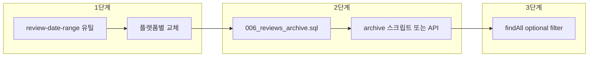

# 180일 통일 및 아카이브 테이블 플랜

## 현재 상태

- **배민**: `setMonth(getMonth() - 6)` 사용 → 6개월 전 같은 날(예: 8/20). 4개 라우트 + 1훅에서 각각 `defaultDateRange()` 중복 정의.
- **요기요**: `setDate(getDate() - 180)` → 180일 전. [yogiyo-review-service.ts](src/lib/services/yogiyo/yogiyo-review-service.ts) 한 곳.
- **땡겨요**: `setDate(getDate() - 180)` → 180일. [ddangyo-review-service.ts](src/lib/services/ddangyo/ddangyo-review-service.ts) 내부 `getDefaultDateRange()`.
- **쿠팡이츠**: `setMonth(getMonth() - 6)` + exclusiveEndDateTime. [coupang-eats-review-service.ts](src/lib/services/coupang-eats/coupang-eats-review-service.ts).
- **리뷰 조회**: [ReviewService.findAll](src/lib/services/review-service.ts)은 `written_at` 필터 없이 전체 조회. 아카이브 테이블 없음.

## 목표

1. **수집 구간**: 모든 플랫폼이 “오늘 기준 과거 180일”(일수 기준)만 요청하도록 통일.
2. **저장 정책**: `reviews`에는 최근 180일 데이터만 유지; 180일 초과 분은 `reviews_archive`로 이관.

---

## 1. 공통 180일 구간 유틸 추가

**파일**: `src/lib/utils/review-date-range.ts` (신규)

- 상수: `REVIEW_RETENTION_DAYS = 180`.
- 함수: `getDefaultReviewDateRange(): { since: Date; to: Date }`
  - `to = new Date()` (오늘 00:00 UTC 또는 로컬 자정으로 통일할지 결정 필요. API들이 날짜 문자열만 쓰므로 `toISOString().slice(0,10)` 호출 측에서 처리 가능).
  - `since = new Date(to); since.setDate(since.getDate() - REVIEW_RETENTION_DAYS)`.
- 필요 시 플랫폼별 포맷 헬퍼: `toYYYYMMDD(date)`, `toYYYY_MM_DD(date)` 등 (배민/요기요는 YYYY-MM-DD, 땡겨요는 YYYYMMDD 등 형식이 다름).

각 플랫폼 서비스/라우트는 이 유틸만 참조하고, 자체 `defaultDateRange`/`getDefaultDateRange`는 제거.

---

## 2. 플랫폼별 날짜 범위 통일

| 대상                                                                                                 | 변경 내용                                                                                            |
| ---------------------------------------------------------------------------------------------------- | ---------------------------------------------------------------------------------------------------- |
| [baemin/reviews/sync/route.ts](src/app/api/stores/[id]/platforms/baemin/reviews/sync/route.ts)       | `defaultDateRange()` 제거, `getDefaultReviewDateRange()` 사용 후 `from`/`to`를 YYYY-MM-DD로 전달     |
| [baemin/reviews/route.ts](src/app/api/stores/[id]/platforms/baemin/reviews/route.ts)                 | 동일                                                                                                 |
| [baemin/reviews/count/route.ts](src/app/api/stores/[id]/platforms/baemin/reviews/count/route.ts)     | 동일                                                                                                 |
| [baemin/reviews/summary/route.ts](src/app/api/stores/[id]/platforms/baemin/reviews/summary/route.ts) | 동일                                                                                                 |
| [use-baemin-reviews.ts](src/entities/store/hooks/query/use-baemin-reviews.ts)                        | 동일                                                                                                 |
| [yogiyo-review-service.ts](src/lib/services/yogiyo/yogiyo-review-service.ts)                         | `defaultDateRange()` 제거, 공통 유틸 사용. `create_from`/`create_to`는 YYYY-MM-DD                    |
| [ddangyo-review-service.ts](src/lib/services/ddangyo/ddangyo-review-service.ts)                      | `getDefaultDateRange()` 제거, 공통 유틸 사용. `from_date`/`to_date`는 YYYYMMDD                       |
| [coupang-eats-review-service.ts](src/lib/services/coupang-eats/coupang-eats-review-service.ts)       | `defaultDateRange()` 제거, 공통 유틸 사용. `startDateTime` / `exclusiveEndDateTime` 형식에 맞게 변환 |

쿠팡이츠의 `exclusiveEndDateTime`(다음날 00:00)은 “180일 + 1일”이 되도록 기존 로직과 동일하게 유지하되, 시작일만 180일 기준으로 맞춘다.

---

## 3. 아카이브 테이블 및 이관

**마이그레이션** (예: `006_reviews_archive.sql`)

- `reviews_archive` 테이블 생성: `reviews`와 동일 컬럼 구조 (id, store_id, platform, external_id, rating, content, author_name, written_at, created_at). PK는 id 또는 (store_id, platform, external_id) 유니크. RLS 정책은 `reviews`와 동일하게 “자기 매장만”.
- 필요 시 `archived_at TIMESTAMPTZ DEFAULT now()` 추가 (이관 시점 기록).

**이관 정책**

- `reviews`에서 `written_at < (현재 시각 - 180일)` 인 행을:
  1. `reviews_archive`에 INSERT (중복 시 ON CONFLICT 무시 또는 업서트 정책 한 가지로 고정)
  2. 해당 리뷰의 `reply_drafts`는 FK `ON DELETE CASCADE`이므로, `reviews`에서 DELETE 시 자동 삭제. 따라서 이관 시: 먼저 INSERT INTO reviews_archive … SELECT … WHERE written_at < cutoff; 이후 DELETE FROM reviews WHERE written_at < cutoff; 로 처리하면 됨.

**이관 실행 주체**

- **옵션 A**: 스크립트 `scripts/archive-old-reviews.ts` (또는 `pnpm run archive-reviews`)로 수동/크론 실행. Supabase service role로 직접 SQL 또는 서버 API 호출.
- **옵션 B**: Next API 라우트 `POST /api/cron/archive-reviews` (Vercel Cron 등에서 호출). 내부에서 동일 로직 실행.

한 가지만 선택해 구현하면 됨 (우선 스크립트로 단순 구현 후, 필요 시 Cron API 추가 권장).

---

## 4. 리뷰 조회 측 변경 (선택)

- **현재**: `ReviewService.findAll`은 `reviews`만 조회하며 `written_at` 조건 없음.
- **아카이브 도입 후**: 이관이 주기적으로 수행되면 `reviews`에는 최근 180일만 남으므로, 별도 필터 없이도 “최근 180일만 보임”.
- **선택 사항**: 180일 초과 데이터가 아직 이관 전일 수 있으므로, “활성 기간만 보기”를 보장하려면 `findAll`에 `written_at >= (today - 180일)` 조건을 추가할 수 있음. 이 경우 공통 유틸의 `since`를 사용해 필터링하면 됨.

---

## 5. 구현 순서 제안

1. **1단계**: `src/lib/utils/review-date-range.ts` 추가 후, 배민 5곳·요기요·땡겨요·쿠팡이츠에서 기존 날짜 로직 제거 및 공통 유틸 사용.
2. **2단계**: `006_reviews_archive.sql` 작성 및 적용, `scripts/archive-old-reviews.ts`(또는 Cron API) 구현.
3. **3단계**: (선택) `ReviewService.findAll`에 `written_at >= since` 조건 추가.

---

## 6. 확인 사항

- **타임존**: `since`/`to`를 UTC 자정 기준으로 할지, 서버 로컬/한국 시간 기준으로 할지 결정. API들이 날짜 문자열만 받는 경우가 많아, “날짜”만 맞으면 되므로 UTC로 통일해도 무방. 필요 시 유틸에서 `toISOString().slice(0,10)` 사용.
- **기존 데이터**: 마이그레이션 적용 후 최초 1회 이관 시, 이미 DB에 있는 180일 초과 리뷰를 한 번에 `reviews_archive`로 옮기면 됨. 이후에는 주기적 실행으로 신규 “늙은” 리뷰만 이관.

이 순서대로 적용하면 “모든 플랫폼 180일 수집 + 180일 초과는 아카이브 테이블에서 관리”가 일괄 적용된다.
