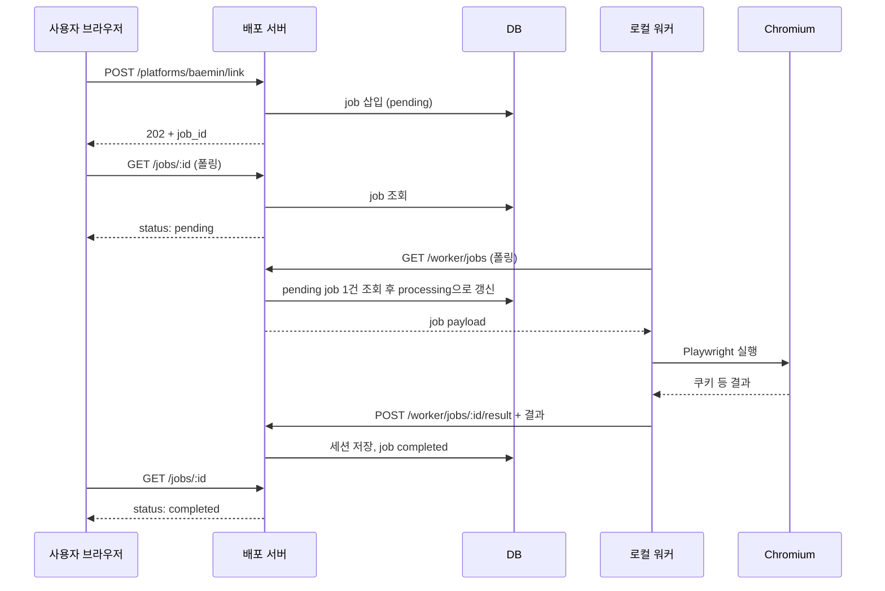

# 서버-로컬 워커 분리 계획 (브라우저 작업 오프로드)

## 목표

- **배포된 서버**: API 트래픽 + DB 조회/저장만 담당. Playwright/Chromium 미실행.
- **연동된 로컬 머신**: 워커 프로세스가 작업을 가져가서 브라우저 실행 후 결과만 서버로 전송.

## 아키텍처

## 1. DB: 작업 테이블

- **마이그레이션** 1개 추가 (예: `supabase/migrations/00x_browser_jobs.sql`).
- **테이블 `browser_jobs`**:
  - `id` (UUID, PK)
  - `type` (enum 또는 text): `baemin_link` | `baemin_sync` | `coupang_eats_link` | `coupang_eats_sync` | `yogiyo_link` | `yogiyo_sync` | `ddangyo_link` | `ddangyo_sync`
  - `store_id` (UUID, FK stores), `user_id` (UUID, FK auth.users) — 소유·RLS용
  - `status`: `pending` | `processing` | `completed` | `failed`
  - `payload` (JSONB): type별 입력 (예: link면 `{ username, password }`, sync면 `{ from?, to? }`)
  - `result` (JSONB, nullable): 완료 시 결과 (link면 `{ external_shop_id, ... }`, sync면 `{ upserted }`)
  - `error_message` (TEXT, nullable): 실패 시 메시지
  - `worker_id` (TEXT, nullable): 작업 처리한 워커 식별자
  - `created_at`, `updated_at`
- 인덱스: `(status, created_at)` — 워커가 pending 조회 시 사용. RLS: `store_id` → `stores.user_id = auth.uid()` (일반 사용자), 워커용은 service role 또는 전용 정책으로 결과만 갱신.

## 2. 서버: 작업 생성 및 API

- **작업 생성 공통화**
  - `src/lib/services/browser-job-service.ts` (또는 `src/lib/jobs/`): `createJob(type, storeId, userId, payload)` → `browser_jobs`에 삽입 후 `jobId` 반환.
- **기존 라우트 변경 (4개 플랫폼 × link + sync = 8개)**
  - [baemin/link/route.ts](src/app/api/stores/[id]/platforms/baemin/link/route.ts), [baemin/reviews/sync/route.ts](src/app/api/stores/[id]/platforms/baemin/reviews/sync/route.ts), 동일 패턴으로 coupang-eats, yogiyo, ddangyo.
  - **동작**:
    - `RUN_BROWSER_ON_SERVER=1`(또는 `NODE_ENV=development` 등)이면 **기존처럼 서버에서 직접** 로그인/동기화 실행 후 201/200 반환 (선택 사항).
    - 그 외: `createJob(...)` 호출 후 **202 Accepted** + `{ jobId }` 반환. body는 기존과 동일 (link: username/password, sync: 필요 시 from/to).
- **작업 상태 API**
  - `GET /api/stores/[id]/jobs/[jobId]` 또는 `GET /api/jobs/[jobId]`: 해당 job의 `status`, `result`, `error_message` 반환. `store_id`·`user_id`로 소유 검증 후 조회.

## 3. 서버: 워커 전용 API (인증 필요)

- **워커 인증**: 헤더 `x-worker-secret` 또는 `Authorization: Bearer <worker-token>`으로 검증. `WORKER_SECRET` env와 비교.
- **작업 가져오기**: `GET /api/worker/jobs` (또는 내부 경로). 쿼리: `?workerId=LOCAL_01`.
  - DB에서 `status = 'pending'` 1건 선택 후 `processing`으로 갱신하고 `worker_id` 설정, 해당 행의 `id`, `type`, `store_id`, `user_id`, `payload` 반환. (동시성: `UPDATE ... WHERE status = 'pending' ... RETURNING` 또는 유사하게 한 건만 잡기.)
- **결과 제출**: `POST /api/worker/jobs/[jobId]/result`. Body: `{ success: true, result?: object }` 또는 `{ success: false, errorMessage: string }`.
  - 서버: `success`면 payload에 따라 기존 로직처럼 세션 저장 또는 리뷰 upsert (기존 [baemin-session-service](src/lib/services/baemin/baemin-session-service.ts), [review-service](src/lib/services/review-service.ts) 등 호출), job을 `completed` + `result` 저장. `success: false`면 `failed` + `error_message` 저장.

워커 API는 RLS에서 제외하거나 service role로 호출하도록 구현 (Next.js API에서 서버 전용 Supabase 클라이언트 사용).

## 4. 로컬 워커 프로세스

- **진입점**: `scripts/worker.js` 또는 `src/worker/run.ts` (같은 레포, Node 실행). 의존성: 기존 `playwright`, `@/lib/services/` 사용 가능하도록 경로/tsconfig 처리.
- **환경 변수**: `SERVER_URL` (배포 서버 기준 URL), `WORKER_SECRET`, `WORKER_ID` (선택, 기본값 `local-1`).
- **루프**:
  1. `GET /api/worker/jobs?workerId=...` 호출.
  2. 작업 없으면 일정 시간 대기 후 1로.
  3. 작업 있으면 `type`에 따라 기존 서비스 호출:
  - `baemin_link` → [loginBaeminAndGetCookies](src/lib/services/baemin/baemin-login-service.ts) + 결과만 반환용 객체 구성.
  - `baemin_sync` → [fetchBaeminReviewViaBrowser](src/lib/services/baemin/baemin-browser-review-service.ts) + [ReviewService.upsertBaeminReviews](src/lib/services/review-service.ts) 호출은 **서버가 result 받은 뒤 서버에서 수행**하는 편이 일관됨. 즉 워커는 **브라우저로 수집한 raw 결과(리뷰 목록 등)** 만 서버로 보내고, 서버가 DB upsert.
  - 그에 맞춰 **link** 타입: 워커가 `cookies`, `external_shop_id` 등만 반환. **sync** 타입: 워커가 수집한 리뷰 배열 등만 반환. 서버의 `POST /worker/jobs/:id/result` 처리 시 기존 session 저장 / review upsert 로직 호출.
  1. `POST /api/worker/jobs/:jobId/result` 로 결과 전송.
  2. 1로 돌아감.
- **에러 처리**: Playwright/로그인 실패 시 `success: false`, `errorMessage` 전송하여 job을 `failed`로 두기.

## 5. 프론트엔드

- [accounts/page.tsx](<src/app/(protected)/stores/[id]/accounts/page.tsx>) 등에서 link/sync 호출 시:
  - 응답이 **202**이고 `jobId`가 있으면 **동기 완료 대기 대신** “작업이 대기 중입니다. 로컬 워커가 처리합니다.” 안내 후, `GET /api/jobs/:jobId` (또는 stores 기준 경로) **폴링**.
  - `status === 'completed'`이면 기존처럼 성공 처리 (세션/리뷰 반영됨). `failed`면 `error_message` 표시.
  - 201/200을 그대로 받으면 기존처럼 즉시 성공 처리 (RUN_BROWSER_ON_SERVER 모드).

## 6. 정리 및 선택 사항

- **큐 저장소**: 첫 단계는 **DB 테이블**로 진행. 추후 동시 처리·재시도 요구가 크면 Redis/Bull 등으로 이전 가능.
- **실행 모드**:
  - **워커 모드**(기본): POST link/sync → 202 + jobId, 로컬 워커가 처리.
  - **서버 실행 모드**(선택): `RUN_BROWSER_ON_SERVER=1`이면 기존처럼 서버에서 Playwright 직접 실행 후 201/200.
- **보안**: `WORKER_SECRET` 강한 값 사용, 워커 API는 서버 내부 또는 VPN 등으로만 노출 권장.

이 계획대로면 배포 서버에는 API·DB 부하만 가하고, 실제 무거운 브라우저 작업은 연동된 로컬 컴퓨터 자원으로만 수행할 수 있다.
